# Awesome MLLM Re-Identification

[](https://github.com/Reflection0427/Awesome-MLLM-ReID/actions/workflows/validate.yml)
[](https://github.com/Reflection0427/Awesome-MLLM-ReID/actions/workflows/discover-papers.yml)

A curated list of papers on **multimodal large language models (MLLMs), large vision-language models (LVLMs), and language-guided foundation models for person/object re-identification**.

本仓库整理大模型与 ReID 的交叉研究。表格最后一列直接展示从固定版本官方 PDF 中裁取的作者原始 Framework / Architecture / Pipeline 图；不使用自绘图、博客截图或 AI 生成图。

**25 reviewed papers · 16 core ReID papers · 9 related methods**

## Scope

Core papers directly apply MLLMs/LVLMs/LLMs to person or object ReID, interactive person retrieval, text-to-image ReID, multimodal ReID, or ReID benchmarks. The related section contains retrieval, embedding, re-ranking, and distillation methods with clear transfer value for MLLM-ReID research.

## Core MLLM / LVLM ReID

| Conference / Journal | Method | Title | Resources | Framework |
| :--- | :--- | :--- | :--- | :--- |
| **CVPR 2026** | **CoT-ReID** | Chain-of-Thought Guided Multi-Modal Object Re-Identification | <a href="https://openaccess.thecvf.com/content/CVPR2026/html/Gao_Chain-of-Thought_Guided_Multi-Modal_Object_Re-Identification_CVPR_2026_paper.html">Paper</a> | <a href="assets/frameworks/cot-reid.png">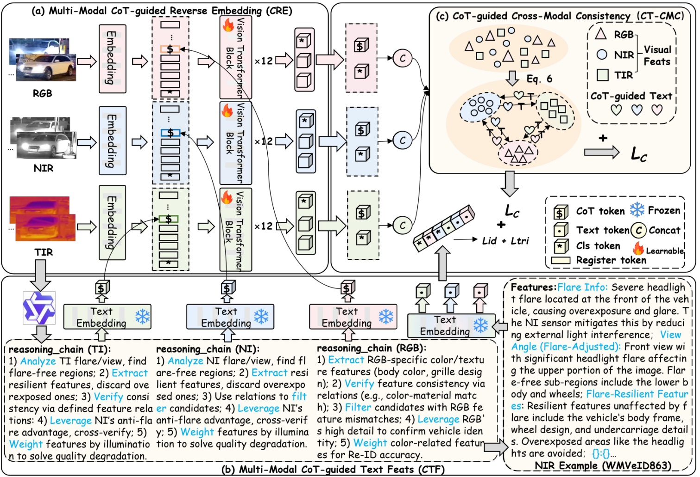</a><br><sub>Original paper figure: Figure 4 · Source: <a href="https://openaccess.thecvf.com/content/CVPR2026/papers/Gao_Chain-of-Thought_Guided_Multi-Modal_Object_Re-Identification_CVPR_2026_paper.pdf">official PDF</a><br>© Paper authors/publisher. All rights remain with the original owner.</sub> |
| **Findings of ACL 2026** | **Auto-ReID** | Iterative Self-Correction for Text-Driven Person Re-Identification with Large Vision-Language Models | <a href="https://aclanthology.org/2026.findings-acl.312/">Paper</a> · <a href="https://github.com/GridNexus/Auto-ReID">Code</a> | <a href="assets/frameworks/auto-reid.png">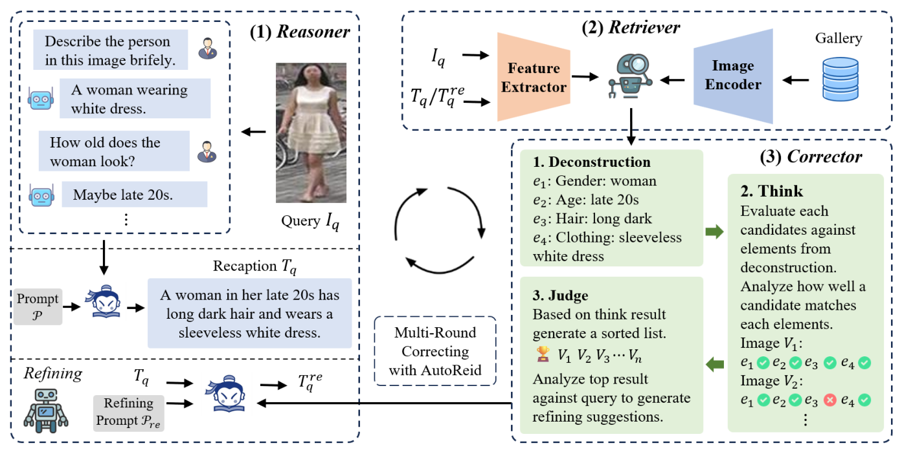</a><br><sub>Original paper figure: Figure 1 · Source: <a href="https://aclanthology.org/2026.findings-acl.312.pdf">official PDF</a><br>© Paper authors/publisher. All rights remain with the original owner. · <a href="https://creativecommons.org/licenses/by/4.0/">License</a></sub> |
| **ICASSP 2026** | **LVLM-ReID** | When Large Vision-Language Models Meet Person Re-Identification | <a href="https://arxiv.org/abs/2411.18111">Paper</a> | <a href="assets/frameworks/lvlm-reid.png">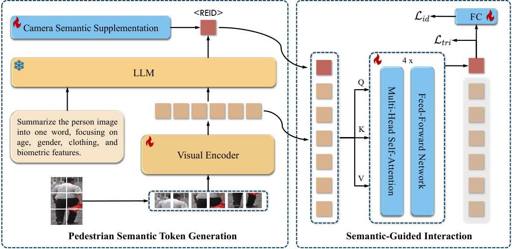</a><br><sub>Original paper figure: Figure 2 · Source: <a href="https://arxiv.org/pdf/2411.18111v2">official PDF</a><br>© Paper authors/publisher. All rights remain with the original owner.</sub> |
| **ICML 2026** | **MNEMO** | Interactive Person Retrieval via Multi-Turn Multimodal Conversation | <a href="https://proceedings.mlr.press/v306/bai26j.html">Paper</a> · <a href="https://github.com/Flame-Chasers/MNEMO">Code</a> | <a href="assets/frameworks/mnemo.png">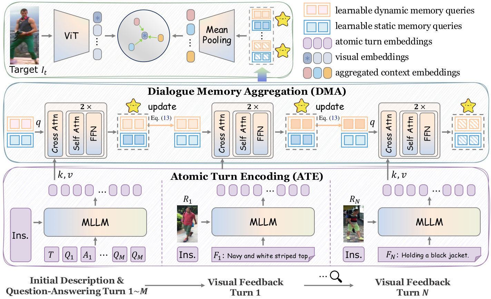</a><br><sub>Original paper figure: Figure 2 · Source: <a href="https://raw.githubusercontent.com/mlresearch/v306/main/assets/bai26j/bai26j.pdf">official PDF</a><br>© Paper authors/publisher. All rights remain with the original owner.</sub> |
| **IET Computer Vision 2026** | **MUVA** | Multi-Grained Vision-Language Alignment for Domain Generalized Person Re-Identification | <a href="https://ietresearch.onlinelibrary.wiley.com/doi/10.1049/cvi2.70062">Paper</a> · <a href="https://github.com/RikoLi/MUVA">Code</a> | <a href="assets/frameworks/muva.png">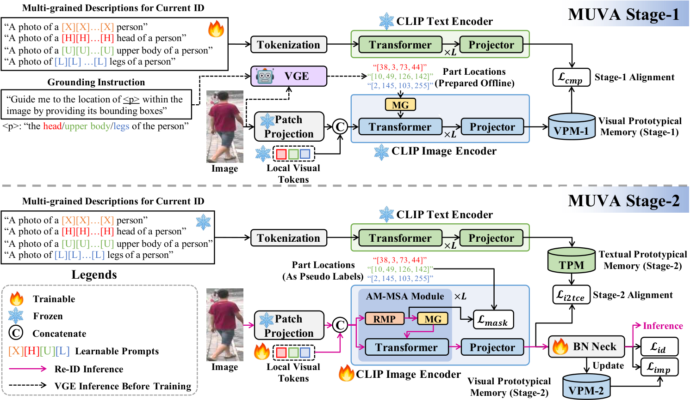</a><br><sub>Original paper figure: Figure 2 · Source: <a href="https://arxiv.org/pdf/2603.14012v1">official PDF</a><br>© Paper authors/publisher. All rights remain with the original owner.</sub> |
| **arXiv 2026** | **MUSE** | Multimodal LLM-Empowered Re-Ranking for Generalizable Person Re-Identification | <a href="https://arxiv.org/abs/2606.16161">Paper</a> · <a href="https://github.com/RikoLi/MUSE">Code</a> | <a href="assets/frameworks/muse.png">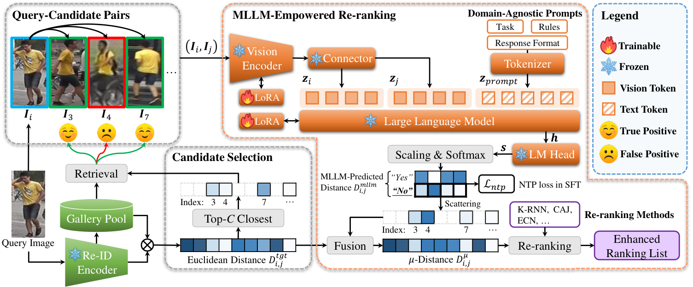</a><br><sub>Original paper figure: Figure 2 · Source: <a href="https://arxiv.org/pdf/2606.16161v1">official PDF</a><br>© Paper authors/publisher. All rights remain with the original owner.</sub> |
| **CVPR 2025** | **HAM + UPS** | Modeling Thousands of Human Annotators for Generalizable Text-to-Image Person Re-identification | <a href="https://openaccess.thecvf.com/content/CVPR2025/html/Jiang_Modeling_Thousands_of_Human_Annotators_for_Generalizable_Text-to-Image_Person_Re-identification_CVPR_2025_paper.html">Paper</a> | <a href="assets/frameworks/annotator-reid.png">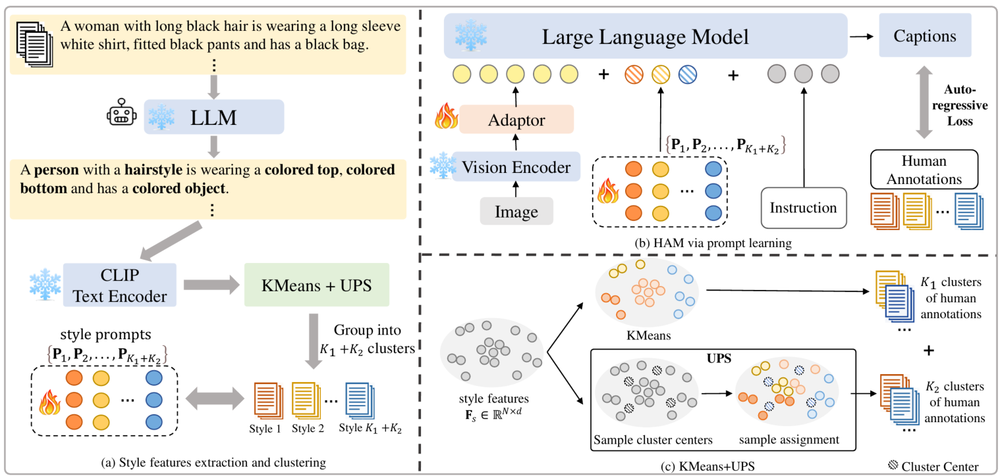</a><br><sub>Original paper figure: Figure 2 · Source: <a href="https://openaccess.thecvf.com/content/CVPR2025/papers/Jiang_Modeling_Thousands_of_Human_Annotators_for_Generalizable_Text-to-Image_Person_Re-identification_CVPR_2025_paper.pdf">official PDF</a><br>© Paper authors/publisher. All rights remain with the original owner.</sub> |
| **CVPR 2025** | **ICL** | Human-centered Interactive Learning via MLLMs for Text-to-Image Person Re-identification | <a href="https://openaccess.thecvf.com/content/CVPR2025/html/Qin_Human-centered_Interactive_Learning_via_MLLMs_for_Text-to-Image_Person_Re-identification_CVPR_2025_paper.html">Paper</a> | <a href="assets/frameworks/icl-reid.png">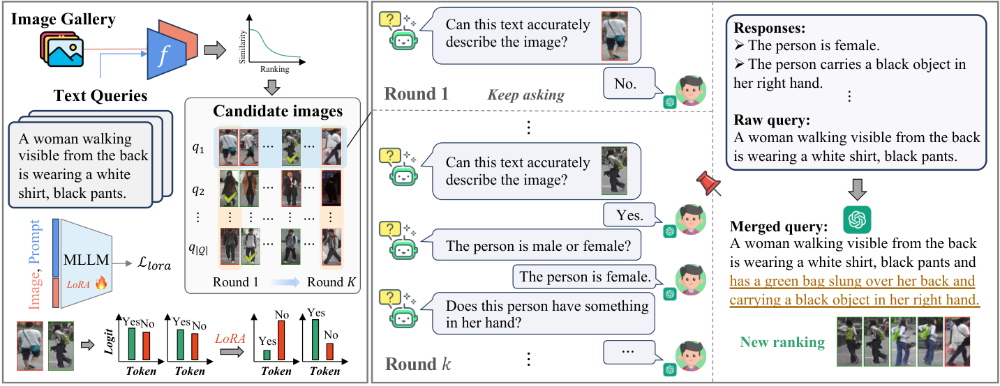</a><br><sub>Original paper figure: Figure 2 · Source: <a href="https://openaccess.thecvf.com/content/CVPR2025/papers/Qin_Human-centered_Interactive_Learning_via_MLLMs_for_Text-to-Image_Person_Re-identification_CVPR_2025_paper.pdf">official PDF</a><br>© Paper authors/publisher. All rights remain with the original owner.</sub> |
| **Findings of EMNLP 2025** | **PVTNL** | PVTNL: Prompting Vision Transformers with Natural Language for Generalizable Person Re-identification | <a href="https://aclanthology.org/2025.findings-emnlp.1181/">Paper</a> | <a href="assets/frameworks/pvtnl.png">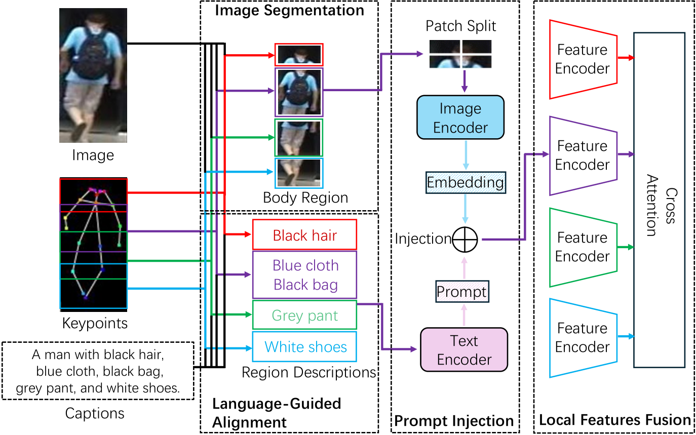</a><br><sub>Original paper figure: Figure 2 · Source: <a href="https://aclanthology.org/2025.findings-emnlp.1181.pdf">official PDF</a><br>© Paper authors/publisher. All rights remain with the original owner. · <a href="https://creativecommons.org/licenses/by/4.0/">License</a></sub> |
| **ICCV 2025** | **ChatReID** | ChatReID: Open-ended Interactive Person Retrieval via Hierarchical Progressive Tuning for Vision Language Models | <a href="https://openaccess.thecvf.com/content/ICCV2025/html/Niu_ChatReID_Open-ended_Interactive_Person_Retrieval_via_Hierarchical_Progressive_Tuning_for_ICCV_2025_paper.html">Paper</a> | <a href="assets/frameworks/chatreid.png">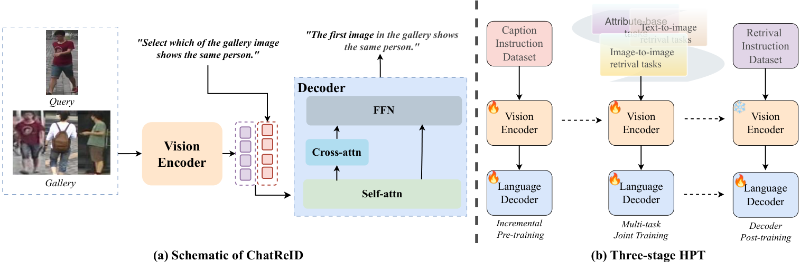</a><br><sub>Original paper figure: Figure 3 · Source: <a href="https://arxiv.org/pdf/2502.19958v3">official PDF</a><br>© Paper authors/publisher. All rights remain with the original owner.</sub> |
| **ICCV 2025** | **VICP** | Generalizable Object Re-Identification via Visual In-Context Prompting | <a href="https://openaccess.thecvf.com/content/ICCV2025/html/Huang_Generalizable_Object_Re-Identification_via_Visual_In-Context_Prompting_ICCV_2025_paper.html">Paper</a> | <a href="assets/frameworks/vicp-reid.png">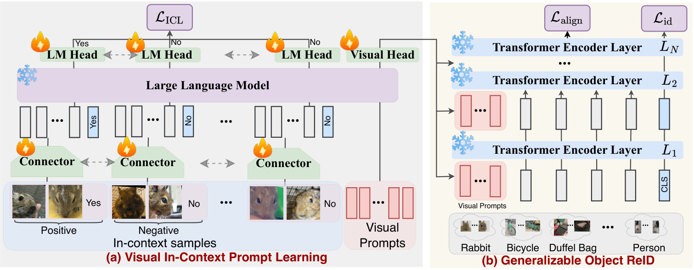</a><br><sub>Original paper figure: Figure 2 · Source: <a href="https://openaccess.thecvf.com/content/ICCV2025/papers/Huang_Generalizable_Object_Re-Identification_via_Visual_In-Context_Prompting_ICCV_2025_paper.pdf">official PDF</a><br>© Paper authors/publisher. All rights remain with the original owner.</sub> |
| **ICML 2025** | **LLaVA-ReID** | LLaVA-ReID: Selective Multi-image Questioner for Interactive Person Re-Identification | <a href="https://proceedings.mlr.press/v267/lu25s.html">Paper</a> · <a href="https://github.com/XLearning-SCU/LLaVA-ReID">Code</a> | <a href="assets/frameworks/llava-reid.png">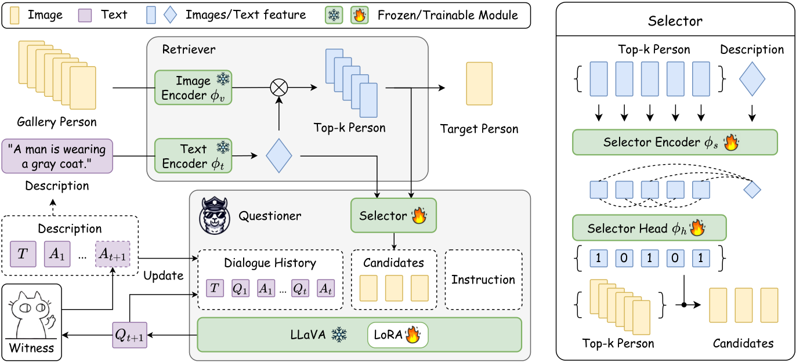</a><br><sub>Original paper figure: Figure 3 · Source: <a href="https://arxiv.org/pdf/2504.10174v3">official PDF</a><br>© Paper authors/publisher. All rights remain with the original owner.</sub> |
| **arXiv 2025** | **MMReID-Bench** | MMReID-Bench: Unleashing the Power of MLLMs for Effective and Versatile Person Re-identification | <a href="https://arxiv.org/abs/2508.06908">Paper</a> | <a href="assets/frameworks/mmreid-bench.png">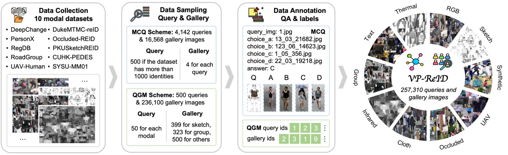</a><br><sub>Original paper figure: Figure 2 · Source: <a href="https://arxiv.org/pdf/2508.06908v2">official PDF</a><br>© Paper authors/publisher. All rights remain with the original owner.</sub> |
| **CVPR 2024** | **Instruct-ReID** | Instruct-ReID: A Multi-purpose Person Re-identification Task with Instructions | <a href="https://openaccess.thecvf.com/content/CVPR2024/html/He_Instruct-ReID_A_Multi-purpose_Person_Re-identification_Task_with_Instructions_CVPR_2024_paper.html">Paper</a> | <a href="assets/frameworks/instruct-reid.png">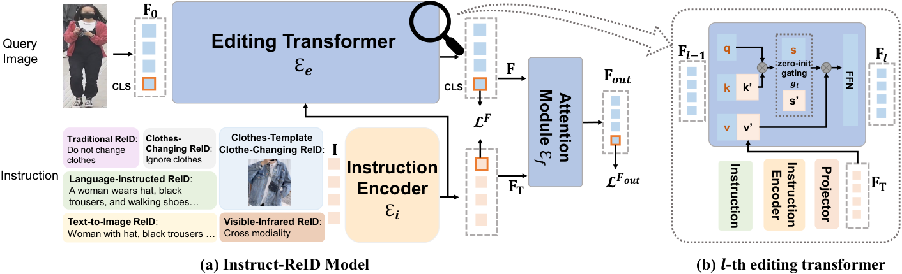</a><br><sub>Original paper figure: Figure 3 · Source: <a href="https://openaccess.thecvf.com/content/CVPR2024/papers/He_Instruct-ReID_A_Multi-purpose_Person_Re-identification_Task_with_Instructions_CVPR_2024_paper.pdf">official PDF</a><br>© Paper authors/publisher. All rights remain with the original owner.</sub> |
| **CVPR 2024** | **MLLM4Text-ReID** | Harnessing the Power of MLLMs for Transferable Text-to-Image Person ReID | <a href="https://openaccess.thecvf.com/content/CVPR2024/html/Tan_Harnessing_the_Power_of_MLLMs_for_Transferable_Text-to-Image_Person_ReID_CVPR_2024_paper.html">Paper</a> · <a href="https://github.com/MPI-Lab/MLLM4Text-ReID">Code</a> | <a href="assets/frameworks/mllm4text-reid.png">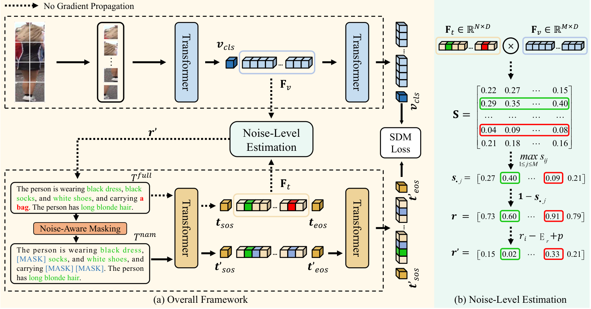</a><br><sub>Original paper figure: Figure 2 · Source: <a href="https://arxiv.org/pdf/2405.04940v3">official PDF</a><br>© Paper authors/publisher. All rights remain with the original owner.</sub> |
| **arXiv 2024** | **MLLMReID** | MLLMReID: Multimodal Large Language Model-based Person Re-identification | <a href="https://arxiv.org/abs/2401.13201">Paper</a> | <a href="assets/frameworks/mllmreid.png">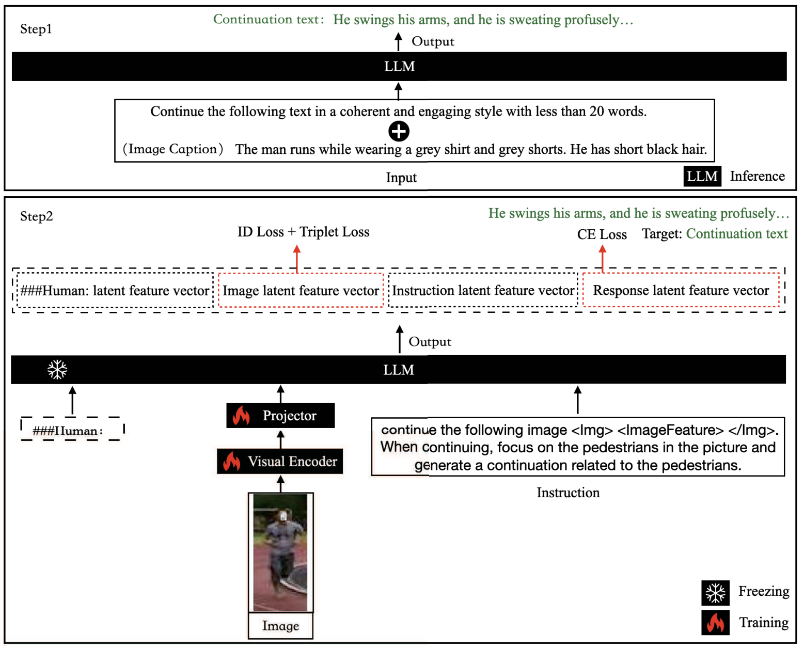</a><br><sub>Original paper figure: Figure 2 · Source: <a href="https://arxiv.org/pdf/2401.13201v3">official PDF</a><br>© Paper authors/publisher. All rights remain with the original owner.</sub> |

## Related MLLM Retrieval / Re-ranking

| Conference / Journal | Method | Title | Resources | Framework |
| :--- | :--- | :--- | :--- | :--- |
| **CVPR 2026** | **ReCALL** | ReCALL: Recalibrating Capability Degradation for MLLM-based Composed Image Retrieval | <a href="https://openaccess.thecvf.com/content/CVPR2026/html/Yang_ReCALL_Recalibrating_Capability_Degradation_for_MLLM-based_Composed_Image_Retrieval_CVPR_2026_paper.html">Paper</a> · <a href="https://github.com/RemRico/Recall">Code</a> | <a href="assets/frameworks/recall.png">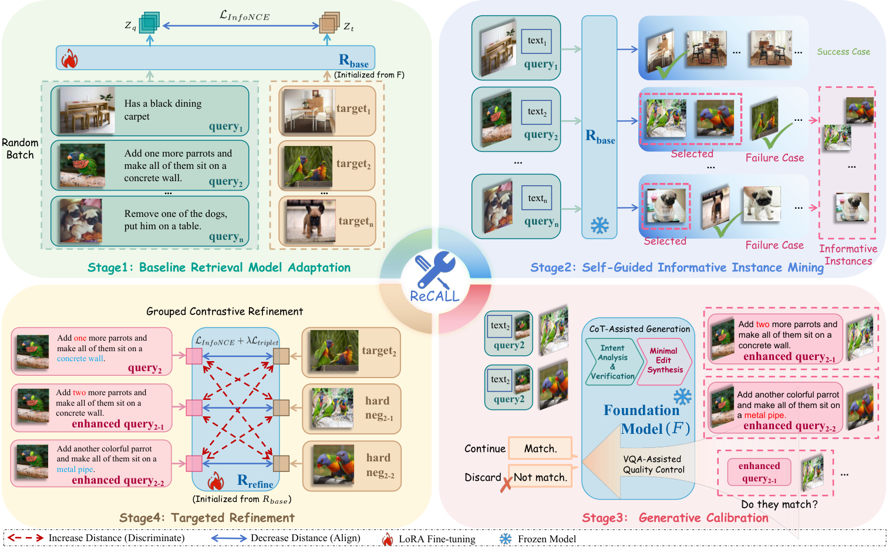</a><br><sub>Original paper figure: Figure 2 · Source: <a href="https://arxiv.org/pdf/2602.01639v2">official PDF</a><br>© Paper authors/publisher. All rights remain with the original owner.</sub> |
| **ICLR 2026** | **U-MARVEL** | U-MARVEL: Unveiling Key Factors for Universal Multimodal Retrieval via Embedding Learning with MLLMs | <a href="https://arxiv.org/abs/2507.14902">Paper</a> · <a href="https://github.com/chaxjli/U-MARVEL">Code</a> | <a href="assets/frameworks/u-marvel.png">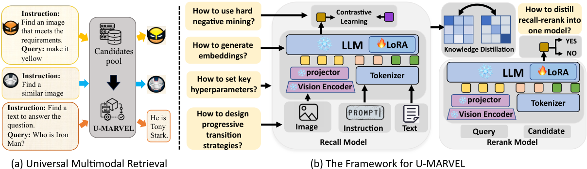</a><br><sub>Original paper figure: Figure 1 · Source: <a href="https://arxiv.org/pdf/2507.14902v2">official PDF</a><br>© Paper authors/publisher. All rights remain with the original owner.</sub> |
| **ICML 2026** | **FreeRet** | FreeRet: MLLMs as Training-Free Retrievers | <a href="https://arxiv.org/abs/2509.24621">Paper</a> · <a href="https://github.com/MCG-NJU/FreeRet">Code</a> | <a href="assets/frameworks/freeret.png">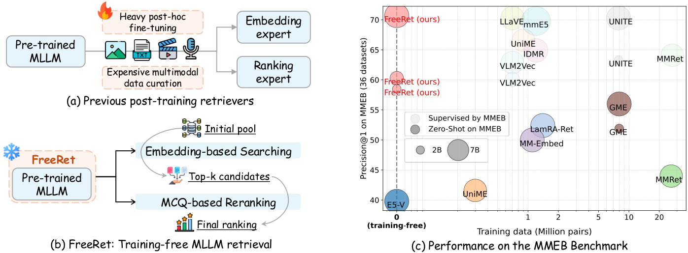</a><br><sub>Original paper figure: Figure 1 · Source: <a href="https://arxiv.org/pdf/2509.24621v3">official PDF</a><br>© Paper authors/publisher. All rights remain with the original owner.</sub> |
| **AAAI 2025** | **CIR-LVLM** | Leveraging Large Vision-Language Model as User Intent-Aware Encoder for Composed Image Retrieval | <a href="https://ojs.aaai.org/index.php/AAAI/article/view/32768">Paper</a> | <a href="assets/frameworks/cir-lvlm.png">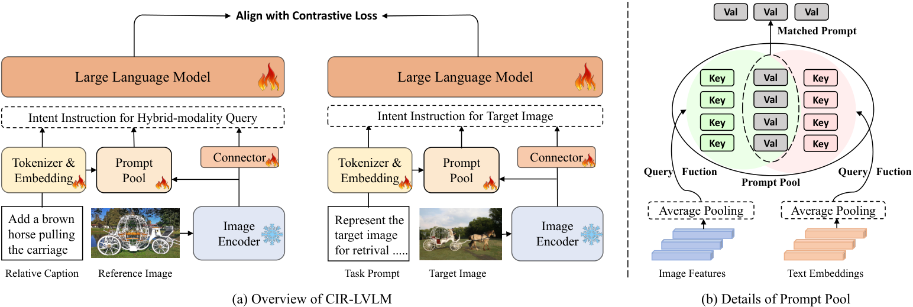</a><br><sub>Original paper figure: Figure 2 · Source: <a href="https://arxiv.org/pdf/2412.11087v1">official PDF</a><br>© Paper authors/publisher. All rights remain with the original owner.</sub> |
| **ICCV 2025** | **DistillCIR** | Zero-Shot Composed Image Retrieval via Dual-Stream Instruction-Aware Distillation | <a href="https://openaccess.thecvf.com/content/ICCV2025/html/Zhong_Zero-Shot_Composed_Image_Retrieval_via_Dual-Stream_Instruction-Aware_Distillation_ICCV_2025_paper.html">Paper</a> · <a href="https://distillcir.github.io/">Project / Model</a> | <a href="assets/frameworks/distillcir.png">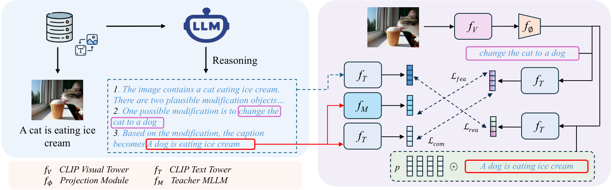</a><br><sub>Original paper figure: Figure 2 · Source: <a href="https://openaccess.thecvf.com/content/ICCV2025/papers/Zhong_Zero-Shot_Composed_Image_Retrieval_via_Dual-Stream_Instruction-Aware_Distillation_ICCV_2025_paper.pdf">official PDF</a><br>© Paper authors/publisher. All rights remain with the original owner.</sub> |
| **ICLR 2025** | **MM-Embed** | MM-Embed: Universal Multimodal Retrieval with Multimodal LLMs | <a href="https://openreview.net/forum?id=i45NQb2iKO">Paper</a> · <a href="https://huggingface.co/nvidia/MM-Embed">Project / Model</a> | <a href="assets/frameworks/mm-embed.png">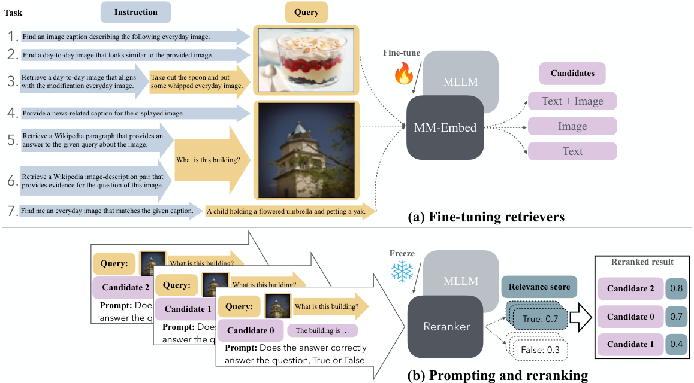</a><br><sub>Original paper figure: Figure 1 · Source: <a href="https://arxiv.org/pdf/2411.02571v2">official PDF</a><br>© Paper authors/publisher. All rights remain with the original owner.</sub> |
| **ICLR 2025** | **VLM2Vec** | VLM2Vec: Training Vision-Language Models for Massive Multimodal Embedding Tasks | <a href="https://arxiv.org/abs/2410.05160">Paper</a> · <a href="https://github.com/TIGER-AI-Lab/VLM2Vec">Code</a> | <a href="assets/frameworks/vlm2vec.png">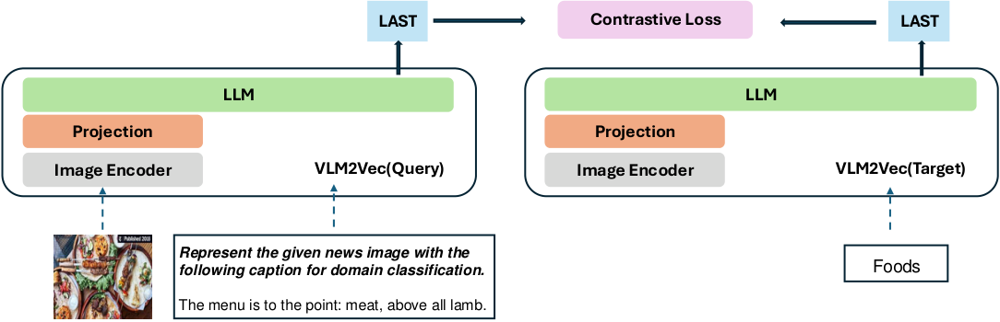</a><br><sub>Original paper figure: Figure 3 · Source: <a href="https://arxiv.org/pdf/2410.05160v3">official PDF</a><br>© Paper authors/publisher. All rights remain with the original owner.</sub> |
| **arXiv 2025** | **CoTRR** | Chain-of-Thought Re-ranking for Image Retrieval Tasks | <a href="https://arxiv.org/abs/2509.14746">Paper</a> · <a href="https://github.com/freshfish15/CoTRR">Code</a> | <a href="assets/frameworks/cotrr.png">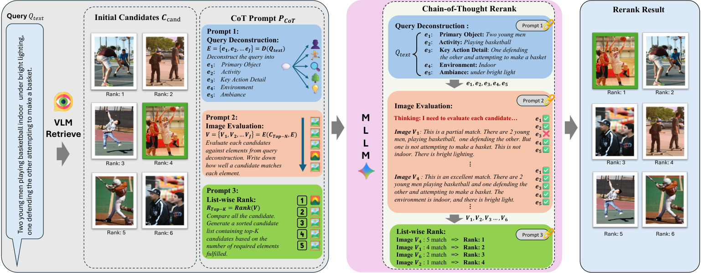</a><br><sub>Original paper figure: Figure 1 · Source: <a href="https://arxiv.org/pdf/2509.14746v1">official PDF</a><br>© Paper authors/publisher. All rights remain with the original owner.</sub> |
| **arXiv 2025** | **SoFT** | Soft Filtering: Guiding Zero-shot Composed Image Retrieval with Prescriptive and Proscriptive Constraints | <a href="https://arxiv.org/abs/2512.20781">Paper</a> · <a href="https://github.com/jjungyujin/SoFT">Code</a> | <a href="assets/frameworks/soft.png">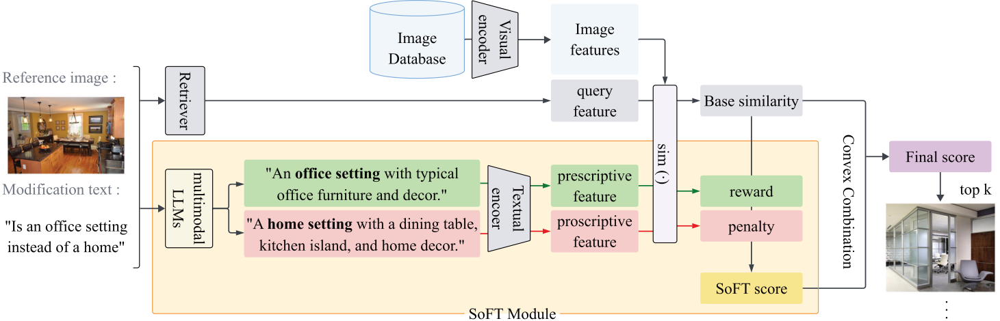</a><br><sub>Original paper figure: Figure 2 · Source: <a href="https://arxiv.org/pdf/2512.20781v1">official PDF</a><br>© Paper authors/publisher. All rights remain with the original owner.</sub> |

## Figure policy

Every Framework image is cropped from the linked official PDF. Metadata in `data/papers.json` records the pinned PDF URL, SHA-256, one-based page number, Figure label, and PDF-point crop rectangle. Only whitespace cropping and lossless PNG compression are allowed. Copyright and all other rights remain with the paper authors or publishers.

Reproduce or verify the images with:

```bash
python -m pip install -r requirements.txt
python scripts/extract_figure.py --all
python scripts/extract_figure.py --all --verify-only
python scripts/generate_readme.py --check
python -m unittest discover -s tests -v
```

## Automatic paper tracking

A scheduled workflow searches arXiv, OpenAlex and Crossref every Monday and opens or updates a candidate pull request. Discovery never adds a paper to this table automatically. A reviewer must read the PDF, verify relevance and metadata, choose the author-created Figure, and generate the PNG before acceptance.

## Contributing

Please open an issue or pull request. See [the review guide](docs/PAPER_TRACKER.md).

## License

Repository code and curator-authored metadata are released under the MIT License. Paper figures remain the property of their respective authors or publishers.
